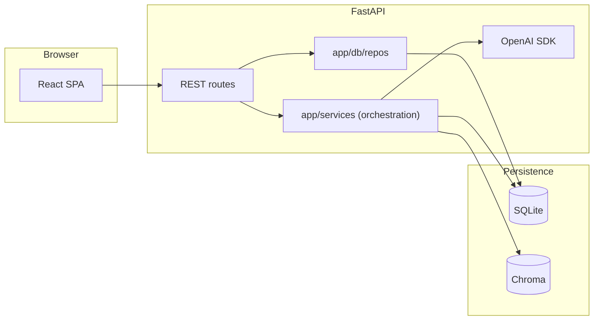

# ScriptSprout — repository layout

High-level map **as of Milestone 10 — Video 26 (admin NLP query + metrics)**. **This file** lives in **`10_AI_Workflow_App/`** next to the top-level [`README.md`](README.md). **Table paths** are relative to the runnable app root **[`ScriptSprout/`](ScriptSprout/)** (contains `backend/`, `frontend/`, `data/`, [`test-scripts/`](ScriptSprout/test-scripts/), `.env`). Update when major folders or flows change.

| Area | Path | Role |
|------|------|------|
| Backend API | `ScriptSprout/backend/app/main.py` | `create_app()`, CORS, OpenAPI defaults, router includes |
| API routes | `ScriptSprout/backend/app/api/routes/` | Feature routers (`health.py`, `meta.py`, `auth.py`, `admin.py`, `admin_nlp.py`, `nlp.py`, `content.py`, `search.py`, `openai_admin.py`, `model_calls_admin.py`, …) |
| API dependencies | `ScriptSprout/backend/app/api/deps.py` | `get_current_user`, `require_roles` / `require_admin` / `require_author`, `get_owned_content_or_404` (author content routes) |
| OpenAI route errors | `ScriptSprout/backend/app/api/openai_route_errors.py` | `ensure_openai_client`, `http_exception_from_openai_route_error` (shared **502** mapping for SDK routes) |
| Query param helpers | `ScriptSprout/backend/app/api/query_params.py` | `normalize_optional_query_str`, shared OpenAPI text for optional ``status`` list filters |
| Auth helpers | `ScriptSprout/backend/app/auth/` | Shared bcrypt helpers (`password.py`) |
| Schemas | `ScriptSprout/backend/app/schemas/` | Pydantic models (`…`, `StoryParametersExtractResponse`, `MissingFieldFollowUp`, `OpenAiSmokeResponse`, …) |
| Database | `ScriptSprout/backend/app/db/` | SQLAlchemy `Base`, ORM models (`User`, `AuthSession`, `ContentItem`, `ModelCall`), bootstrap + admin seed, `deps.get_db`, `repos/` |
| Exception handling | `ScriptSprout/backend/app/handlers.py` | Normalizes HTTP, validation, and 500 errors to `ErrorResponse` |
| Settings | `ScriptSprout/backend/app/config.py` | `get_settings()` (`lru_cache`) from **`ScriptSprout/.env`** (`OPENAI_*`, `TRANSIENT_RETRY_MAX_ATTEMPTS`, …) |
| API tests | `ScriptSprout/backend/tests/` | pytest + FastAPI `TestClient`; extend when routes change |
| Frontend UI | `ScriptSprout/frontend/src/` | React + Vite SPA |
| Frontend E2E | `ScriptSprout/frontend/playwright.config.ts`, `ScriptSprout/frontend/e2e/` (e.g. `auth-shell.spec.ts`) | **Playwright** (`@playwright/test`); **`testDir: ./e2e`**; run from **`ScriptSprout/frontend/`** — see [`ScriptSprout/frontend/README.md`](ScriptSprout/frontend/README.md) |
| Static web assets | `ScriptSprout/frontend/public/` | Favicon, `images/logo.png`, etc. (served at site root) |
| Local data | `ScriptSprout/data/` | SQLite + Chroma persistence (gitignored except `.gitkeep`) |
| Automation | `ScriptSprout/test-scripts/` | Cross-stack **`test.sh`**, **`test-e2e.sh`**, **`test-postman.sh`**, **`verify.sh`**; **`test-cleanup.sh`** is **manual only** (test/build cache cleanup — see [`ScriptSprout/test-scripts/README.md`](ScriptSprout/test-scripts/README.md)). At **`ScriptSprout/`** root: **`startup.sh`**, **`shutdown.sh`**, **`reset-db-and-chroma.sh`** (dev servers + local data wipe). |
| Services (integrations) | `ScriptSprout/backend/app/services/` | OpenAI client, smoke, NLP **`story_parameter_extraction`**, **`missing_field_follow_up`**, story/thumbnail/audio generation, **`chroma_store`** (persistent client, **`rebind_app_chroma_after_disk_wipe`** after admin cleanse; collection metadata **`embedding_model`**), **`embedding_index`**, **`semantic_search`**, **`openai_retry`** |
| Secrets | `ScriptSprout/.env` (not committed) | Copy from **`ScriptSprout/.env.example`** |

## Brand tokens in the UI

Approved colors are listed in the **Brand Colors** table in [`README.md`](README.md). The SPA maps them in `ScriptSprout/frontend/src/index.css` (`--color-primary`, `--color-secondary`, `--color-highlight`, `--color-bg`) and applies accents in `ScriptSprout/frontend/src/App.css`.

## Request flow (as implemented)

The browser talks to **FastAPI routers** under `ScriptSprout/backend/app/api/routes/`. Handlers validate auth (via **`app/api/deps.py`**), attach **`Session`** / settings / **`chroma_collection`**, and run the business logic: **generative and integration flows** live in **`app/services/*`** (OpenAI `responses.create`, **`responses.parse`**, **Images**, **Audio** (TTS), **Embeddings**, Chroma helpers, retries); **some routes** also call **`app/db/repos/*`** directly for CRUD, lists, or admin metrics without a separate service wrapper. There is **no** separate agent runtime (e.g. OpenAI Agents SDK) and **no** OpenAI **function / tool-calling** loop; multi-step behavior is **explicit Python** (retries, guardrails drafts, admin NLP: **parse a plan** → **run metrics and/or semantic search** in process).

*Thin path: **API → app/db/repos → SQL** (e.g. list/detail routes, some admin reads). **SVC → OpenAI / SQL / Chroma** covers generative workflows and indexing. A single handler may use **both** repos and services (e.g. content routes).*

**Endpoints and data (Video 26):** The SPA and API expose:

- **SPA routes:** Public **`/`**, **`/login`**, **`/register`**, **`/verify-email`**. Author **`/studio`**, **`/profile`**. Admin **`/admin-dashboard`**, **`/admin-nlp`**. Legacy **`/workspace`**, **`/draft-review`**, and **`/story-media`** redirect to **`/studio`**.
- **Health & meta:** **`GET /health`**. **`GET /api/meta/*`** returns **404** unless **`EXPOSE_META_WITHOUT_AUTH=true`**. Admin user seed on bootstrap.
- **SQLite:** **`users`**, **`sessions`**, **`content_items`** (story fields; **`thumbnail_*`** / **`audio_*`** blobs), **`model_calls`**, **`audit_events`**, **`generation_runs`**, **`guardrails_events`**.
- **Author API:** **`/api/auth/*`** with **RBAC**. **`/api/content/*`**: synopsis → title/description → story + guardrails → thumbnail + audio; **`POST …/semantic-index`** upserts **Chroma** **`content_semantic_index`** (title/description/story embeddings); **`GET …/thumbnail`** and **`GET …/audio`** return stored bytes; **`approve-step`** / **`regenerate-step`** where applicable. **`POST /api/nlp/extract-story-parameters`**: **`responses.parse`** + **`follow_up`**.
- **Search:** **`POST /api/search/semantic`** — Chroma query + SQLite hydrate; author- or admin-scoped.
- **Admin API:** **`GET /api/admin/ping`**, **`GET /api/admin/metrics`**, **`GET /api/admin/content/`** (list) and **`GET /api/admin/content/{id}`** (detail), **`POST /api/admin/nlp-query`** (`responses.parse` → plan, then **`compute_admin_metrics`** / **`run_semantic_search`** — not OpenAI tool calls), **`POST /api/admin/openai/smoke`**, **`GET /api/admin/model-calls/`**, **`GET /api/admin/generation-runs/{id}`**, **`POST /api/admin/cleanse`** (**403** unless **`ALLOW_ADMIN_CLEANSE=true`**).

## Admin cleanse

**`POST /api/admin/cleanse`** — destructive, **admin-only** reset (requires **`ALLOW_ADMIN_CLEANSE=true`**, **`confirm: true`**, and **`ADMIN_USERNAME` / `ADMIN_PASSWORD`** set so the admin user can be reseeded).

- **SQLite:** Deletes app data in dependency-safe order (sessions, model calls, guardrails events, generation runs, audit events, content items, users), then inserts a fresh admin from env.
- **Chroma:** Deletes the entire configured **`CHROMA_PATH`** directory on disk and recreates an empty folder (same path the app uses for the vector store). So a single cleanse clears **both** structured rows and **all** indexed vectors under that path.

**After cleanse:** The handler immediately reopens Chroma and replaces **`app.state.chroma_client`** / **`chroma_collection`** so semantic index/search match the wiped directory without requiring a process restart.

Treat this route like a **production hazard**: protect or remove it when the API is exposed beyond trusted operators.

## Dev servers

- **API:** from **`ScriptSprout/backend/`**, `uv run uvicorn app.main:create_app --factory --reload --host 127.0.0.1 --port 8000` (see [`README.md`](README.md); `uv sync` manages `.venv`). SQLite file defaults to **`ScriptSprout/data/app.db`** (via `SQLITE_PATH`).
- **UI:** Vite on `http://127.0.0.1:5173`, proxying `GET /health` and `/api/*` to the API for same-origin fetches.
