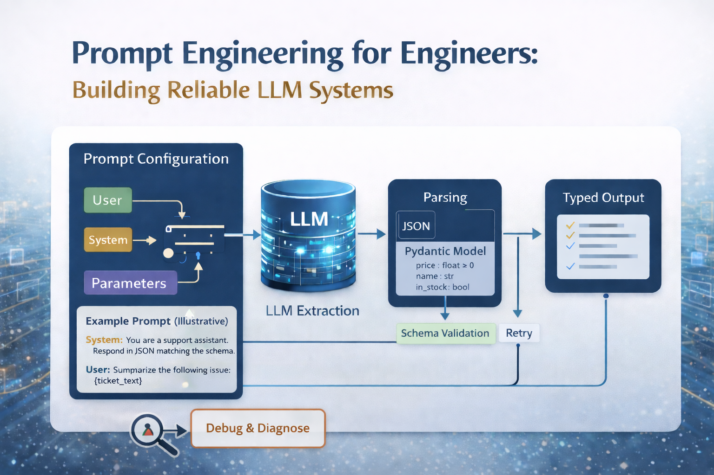

# Prompt Engineering for Engineers

Content for controlling LLM behavior through systematic prompt design.



## Overview

This module teaches prompt engineering as **runtime configuration** rather than "clever wording." You'll learn to treat prompts as behavior specifications for probabilistic systems, focusing on reliability, structure, and engineering patterns.

## What You'll Learn

- How to control LLM behavior through message roles and instruction hierarchy
- Building reusable, parameterized prompt templates
- Enforcing constraints and guardrails
- Generating structured, validated outputs with Pydantic
- Prompting techniques: few-shot learning, chain-of-thought, prompt chaining

## Prerequisites

- **Python 3.12+**
- **OpenAI API key** (set in `.env` file)
- Basic understanding of LLM APIs (see `1_LLMs/` if needed)

## Setup

1. **Navigate to the directory:**
```bash
cd 3_Prompt_Engineering
```

2. **Create virtual environment:**
```bash
uv venv --python python3.12
```

3. **Activate virtual environment:**
```bash
source .venv/bin/activate
```

4. **Install dependencies:**
```bash
uv pip install -r requirements.txt
```

5. **Configure API key:**
```bash
cp .env.example .env
# Edit .env and add your OpenAI API key
```

## Notebooks

### 1. Foundations (`demo/1_Foundations.ipynb`)
**Focus:** Mental models and message roles

- Why prompting is runtime configuration, not clever wording
- Prompts as behavior specifications
- System vs user messages; application context in the system message
- Instruction priority and conflict resolution
- Demo: Same prompt, different role → different output

### 2. Structure & Constraints (`demo/2_Structure_and_Constraints.ipynb`)
**Focus:** Building reusable, controlled prompts

- Parameterized prompt templates
- Prompt composition patterns
- Hard vs soft constraints
- Limiting scope and controlling style
- Demo: Reusable prompt functions with guardrails

### 3. Structured Outputs (`demo/3_Structured_Outputs.ipynb`)
**Focus:** Reliability through typed outputs (Deep Dive)

- Why free-text responses are dangerous
- JSON mode and schema-based prompting
- Pydantic models for validation
- Handling invalid outputs (retries, fallbacks)
- Demo: End-to-end structured extraction with validation

### 4. Advanced Prompting Techniques (`demo/4_Advanced_Prompting_Techniques.ipynb`)
**Focus:** Advanced prompting patterns

- Zero-shot vs few-shot prompting
- Chain-of-thought reasoning
- When reasoning helps vs hurts
- Prompt chaining and decomposition
- Demo: Multi-stage pipeline

## Running the Notebooks

From the `3_Prompt_Engineering` directory, use `uv run` to launch JupyterLab with the project's virtual environment:

```bash
# Launch JupyterLab
uv run jupyter lab

# Or launch a specific notebook
uv run jupyter lab demo/1_Foundations.ipynb
```

## Cost Estimate

Using `gpt-4o-mini`, running all notebooks costs approximately **$0.01-0.02** total. Each notebook contains 10-20 API calls with small prompts.

## Notes

- All notebooks use **OpenAI's API** (`gpt-4o-mini` recommended)
- Structured outputs require OpenAI's native JSON mode and schema enforcement
- Examples are designed for video demonstrations and hands-on learning
