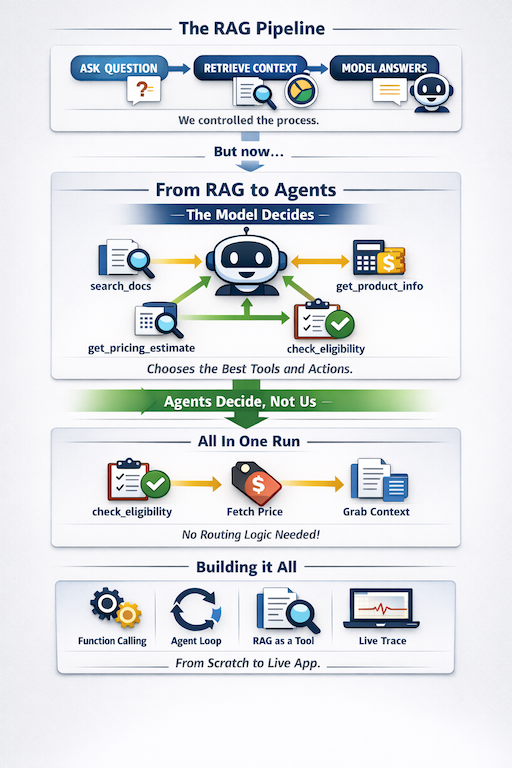

# Agents: Function Calling, Agent Loops, and RAG as a Tool

This module introduces AI agents — systems where the LLM decides what to do, not just what to say. It builds directly on the RAG pipeline from module 4 and the app pattern from module 5.

<p align="center">
  
</p>

## The Core Idea

In the RAG modules, we always told the model exactly what context to use. An agent is different: we give the model a set of **tools** and it decides which ones to call, with what arguments, based on the question. That decision-making loop is what makes it an agent.

**RAG retrieves. Agents decide.**

## What's New Here vs the RAG Modules

| | RAG (modules 4–5) | Agents (this module) |
|---|---|---|
| Model role | Answer from given context | Decide what to do, then answer |
| Retrieval | Always happens, same way | One tool among many — model chooses when |
| API surface | `chat.completions.create` | + `tools`, `tool_calls`, `tool` role |
| Multi-step | No | Yes — loop until done |
| Reasoning visible | No | Yes — full message history / trace |

---

## Layout

```
6_Agents/
├── README.md
├── data/
│   └── AI_Agent_Insure.md        # company document — used by notebooks and app
├── tools/
│   ├── __init__.py               # re-exports TOOL_SCHEMAS and TOOL_FUNCTIONS
│   └── tools.py                  # shared tool definitions (schemas + implementations)
├── notebooks/
│   ├── .env.example
│   ├── requirements.txt          # openai, chromadb, jupyterlab, python-dotenv
│   ├── 1_Function_Calling.ipynb  # manual tool call walkthrough
│   ├── 2_Agent_Loop.ipynb        # automated while loop, multi-step reasoning
│   └── 3_Agent_App.ipynb         # RAG as a tool + full system demo
└── app/
    ├── .env.example
    ├── requirements.txt          # openai, chromadb, streamlit, python-dotenv
    └── agent_app.py              # Streamlit app
```

The `tools/` package is shared — both `notebooks/` and `app/` import from it. Each sub-project has its own `requirements.txt` and its own virtual environment.

---

## What's in Each File

### `tools/tools.py`

Shared tool definitions used by all notebooks and the app.

Three tools, each with two parts:
1. A **Python function** that does the actual work
2. An **OpenAI schema** (a dict) that describes the tool to the model

| Tool | What it does |
|---|---|
| `get_product_info(product_name)` | Returns a description of a named insurance product |
| `get_pricing_estimate(coverage_type, company_size)` | Returns a rough annual premium range |
| `check_eligibility(industry)` | Returns whether an industry is in the target market |

Also exports `TOOL_SCHEMAS` (list of schema dicts for the API) and `TOOL_FUNCTIONS` (name → function dispatch dict for the agent loop).

---

### `notebooks/1_Function_Calling.ipynb` — How the model uses tools

**The manual walkthrough.** No loops — every step is explicit so you can see exactly what happens.

1. Inspect the tool schemas — what the model actually reads
2. Send a question with `tools=TOOL_SCHEMAS` — see the raw `tool_calls` response
3. Parse the `tool_calls` object — understand the structure (id, name, arguments)
4. Execute the tool manually and feed the result back with `role: "tool"`
5. Second API call — model reads the result and writes a final answer
6. Demo: three different questions → model routes to a different tool each time (no hardcoded routing)
7. Demo: a general question → model answers directly without calling any tool

**Key concept:** `finish_reason: "tool_calls"` means the model is mid-task. `"stop"` means it's done.

---

### `notebooks/2_Agent_Loop.ipynb` — The while loop that is the agent

**Automates everything from Notebook 1** into a reusable `run_agent()` function.

The loop:
```
send messages
  → if finish_reason == "tool_calls": execute tools, append results, repeat
  → if finish_reason == "stop": return final answer
```

1. `run_agent()` — the loop as a clean function with a max-iterations safety guard
2. Single tool call — same result as Notebook 1, automated
3. **Two tool calls in sequence** — a question that requires `check_eligibility` then `get_pricing_estimate`; the model decides to call both without being told to
4. Full message history printed — shows the complete reasoning trace (user → tool_call → tool result → tool_call → tool result → final answer)
5. Safety guard demo — `max_iterations=1` forces the loop to stop early

**Key concept:** The message history is the agent's memory. Every tool result is visible to the model on the next iteration.

---

### `notebooks/3_Agent_App.ipynb` — RAG as a tool

**Adds a fourth tool: `search_docs`** — the RAG pipeline from module 4 wrapped as an agent tool.

```python
def search_docs(query: str) -> str:
    # embed query → retrieve top-k chunks from ChromaDB → return as string
```

The agent now has four tools and routes between them based on the question:

| Question type | Tool(s) called |
|---|---|
| "What does X product cover?" | `get_product_info` |
| "How much would X cost for a startup?" | `get_pricing_estimate` |
| "Can a healthcare company get coverage?" | `check_eligibility` |
| "How does the claims process work?" | `search_docs` |
| "Explain underwriting philosophy and price X for a startup" | `search_docs` + `get_pricing_estimate` |

**Key concept:** RAG becomes one tool among many. The model decides when to search the document vs use a structured lookup vs do both.

---

### `app/agent_app.py` — Streamlit app

Same question interface as the RAG app in module 5. Key addition: an expandable **Agent trace** panel showing every tool call the agent made — tool name, arguments, and result.

The trace panel is what makes an agent app different from a RAG app — the reasoning is visible, not just the answer.

---

## Prerequisites

- Python 3.12+
- OpenAI API key
- `uv` for environment management

---

## Setup — Notebooks

```bash
cd 6_Agents/notebooks
uv venv --python python3.12
source .venv/bin/activate
uv pip install -r requirements.txt
```

Register the venv as a Jupyter kernel:

```bash
python -m ipykernel install --user --name agents-notebooks --display-name "Agents (notebooks)"
```

Add your API key:

```bash
cp .env.example .env
# then edit .env and replace the placeholder with your key
```

```bash
jupyter lab
```

When a notebook opens, select **Agents (notebooks)** from the kernel selector in the top-right.

Run in order:
1. `1_Function_Calling.ipynb`
2. `2_Agent_Loop.ipynb`
3. `3_Agent_App.ipynb`

---

## Setup — App

```bash
cd 6_Agents/app
uv venv --python python3.12
source .venv/bin/activate
uv pip install -r requirements.txt
```

Add your API key:

```bash
cp .env.example .env
# then edit .env and replace the placeholder with your key
```

```bash
source .venv/bin/activate
streamlit run agent_app.py
```

---

## Cost

All notebooks use `gpt-4o-mini` and `text-embedding-3-small`. Running all three notebooks is in the **low cents** range.

---

## How This Connects to the Rest of the Playlist videos

```
4_RAG      → RAG pipeline (load → chunk → embed → retrieve → generate)
5_RAG_App  → RAG packaged as a Streamlit app
6_Agents   → RAG becomes one tool; the LLM decides when to use it
```

The `AI_Agent_Insure.md` document and the sentence-chunking + ChromaDB pattern carry over directly from modules 4 and 5. The new concepts are the tool schema format, the `tool_calls` API response, and the agent loop.
