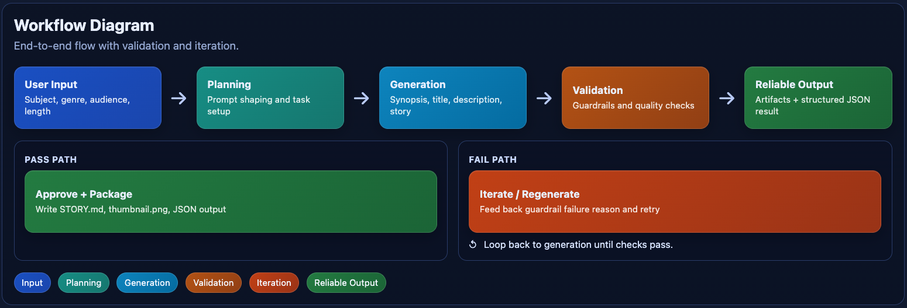
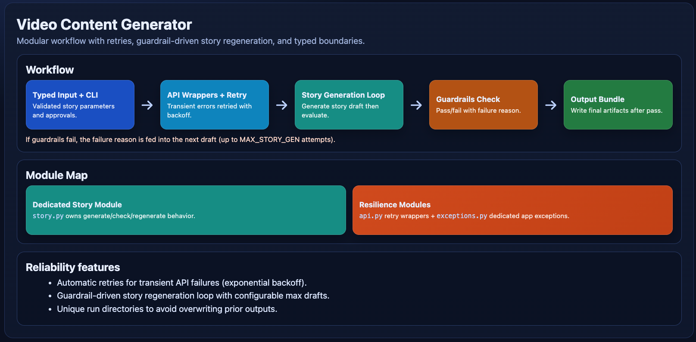

# AI Workflows — Video Content Generator

**Learning objective:** Build an AI workflow that is **structured**, **typed**, and **resilient**—retries on transient API failures, **multi-draft story correction** when guardrails fail, **safe output paths**, and a clear split between CLI, orchestration, OpenAI integration, and filesystem output.

This app is a **Python CLI** that generates video narration content (synopsis, title, description, full story script, and a **YouTube-style thumbnail** via OpenAI’s **Images API** / **gpt-image-1-mini**) using the **OpenAI API**. Project files live in this chapter directory (`pyproject.toml`, docs, diagrams); the importable package is under [`src/`](src/). It uses **Pydantic** models, **clear module boundaries**, **retries on transient API errors**, **multi-draft story generation** when guardrails fail, and **collision-safe output folders**. Run it with **`uv run video-content-generator`** (see Quick start).

## The application

Given a user-provided subject, genre, age group, and target length, the app produces:

- **STORY.md** — the approved title, description, and full narration text.
- **thumbnail.png** — thumbnail image from the Images API (default **gpt-image-1-mini**, cartoon style tuned to the target age group).

The CLI prints a JSON result to stdout (pipeable with `jq`), with all status messages on stderr.

### Pipeline

| Step | API | What it produces |
|------|-----|------------------|
| 1. Synopsis | `responses.create` | 2–4 sentence story outline |
| 2. Title | `responses.create` | Short video title |
| 3. Description | `responses.create` | YouTube-style description |
| 4. Full story | `responses.create` | Complete narration script |
| 5. Guardrails check | `responses.parse` | Structured pass/fail review |
| 6. Thumbnail | `images.generate` | GPT Image PNG (default **1536×1024**, low quality, cartoon-style) |

Steps 1–3 use an interactive approve/regenerate loop. The story is generated and checked against guardrails; if the check fails, the failure reason is fed into the next draft (up to **`MAX_STORY_GEN`** attempts, default **2**). The thumbnail is generated only after the story passes guardrails. If every draft fails the guardrails check, the run aborts with an error and no output bundle is written. If an error is raised earlier (for example a rare API failure before story text completes), the Images API is not called. Quitting during an approval prompt also exits before the thumbnail step. All API calls use **retry with exponential backoff** on transient errors (rate limits, connection issues, timeouts, server errors).

### Diagrams





### Requirements

- Python 3.12+
- [uv](https://docs.astral.sh/uv/) for dependency management and running commands
- An [OpenAI API key](https://platform.openai.com/api-keys)

---

## Project layout

| Path | Purpose |
|------|---------|
| [`pyproject.toml`](pyproject.toml), [`uv.lock`](uv.lock) | App root: dependencies, lockfile; CLI via `[project.scripts]` → `video-content-generator` |
| [`src/`](src/) | Python package **`video_content_generator`** (mapped in `pyproject.toml`) |
| [`img/`](img/) | Workflow and module diagram PNGs for this README |
| [`MODEL_USAGE_GUIDE.md`](MODEL_USAGE_GUIDE.md) | Environment variables, model resolution chain, code map |

### Package source tree

Run **`uv`** and the CLI from this chapter directory (`9_AI_Workflows/`). Package modules:

```
src/                       # import name: video_content_generator
    __init__.py
    api.py
    cli.py
    config.py
    exceptions.py
    output_bundle.py
    prompts.py
    schemas.py
    story.py
    workflow.py
```

---

## Model usage (summary)

Environment variables include `OPENAI_API_KEY`, `BASE_MODEL`, per-step model overrides, thumbnail settings, **`MODEL_THUMBNAIL_TEXT_CHECK`**, **`MAX_STORY_GEN`**, **`MAX_THUMBNAIL_GEN`**, and `OUTPUT_DIR`. Thumbnail defaults are **gpt-image-1-mini** at **1536×1024** with **low** quality (supported sizes: `auto`, `1024×1024`, `1536×1024`, `1024×1536`; quality: `auto`, `low`, `medium`, `high`). `MODEL_THUMBNAIL_TEXT_CHECK` falls back to `BASE_MODEL` when unset (cost-effective default with `gpt-5-nano`). `MAX_THUMBNAIL_GEN` defaults to **2** (initial image + one retry if text is detected).

Full tables and resolution chain: **[`MODEL_USAGE_GUIDE.md`](MODEL_USAGE_GUIDE.md)**.

### Recommended starter configuration

```
OPENAI_API_KEY=sk-...
BASE_MODEL=gpt-5-nano
MODEL_STORY=gpt-4o-mini
```

The guardrails check model should differ from the story model to avoid self-review.

### OpenAI APIs used

| API | Method | Used for |
|-----|--------|----------|
| Responses | `responses.create` | Text generation (synopsis, title, description, story) |
| Responses | `responses.parse` | Structured guardrails check (Pydantic schema) |
| Images | `images.generate` | gpt-image-1-mini thumbnail |

---

## Quick start

```bash
cd 9_AI_Workflows
cp .env.example .env
# Edit .env: set OPENAI_API_KEY (and optional model vars)
uv sync
uv run video-content-generator
```

---

## Using the CLI

The CLI prompts for four parameters:

1. **Subject** — e.g. "a unicorn who learns to fly"
2. **Genre** — e.g. "adventure", "cozy mystery"
3. **Age group** — e.g. "children", "teens", "young adult"
4. **Video length** — target minutes as a positive whole number (e.g. 4); the prompt suggests **3–5** for typical short-form narration

Enter `q`, `quit`, or `exit` at any prompt to stop. Ctrl+C and Ctrl+D also exit cleanly.

After each text step, the workflow shows generated text and asks for approval before continuing:

```
--- Step 1: Synopsis ---

Using model: gpt-5-nano (synopsis)
[generated synopsis text]

Approve? [y]es accept / [n]o regenerate / [q]uit:
```

### Piping

Because status goes to stderr and the final result to stdout:

```bash
uv run video-content-generator | jq .title
```

---

## Programmatic usage

The package exports what you need to run the workflow without the interactive CLI:

```python
from openai import OpenAI
from video_content_generator import AppConfig, StoryParameters, run_workflow

client = OpenAI()
cfg = AppConfig.from_env()
params = StoryParameters(
    subject="a robot who discovers music",
    genre="adventure",
    age_group="children",
    video_length=4,
)

result = run_workflow(client, cfg, params, approve_fn=lambda text: True)
print(result.model_dump_json(indent=2))
```

The `approve_fn` callback receives the generated text and returns `True` to accept or `False` to regenerate. The CLI wires this to a terminal prompt; a UI can supply its own logic. For guardrail failures, import **`GuardrailsViolation`** from the package root.

---

## Guardrails

Safety and style rules are enforced at two levels:

1. **Prompt-level** — every text generation call includes instructions that prohibit violence, explicit content, profanity, hashtags, and emojis. Age-appropriate tone is specified from the target audience.

2. **Post-generation check** — the full story is reviewed with OpenAI structured outputs (`responses.parse` + Pydantic). The checker returns `passed: bool` and `failure_reason: str`. If the check fails, the story is regenerated with that reason in the prompt. If all attempts fail, the run aborts with **`GuardrailsViolation`** — non-compliant stories are not saved or returned.

**`MODEL_STORY_GUARD`** defaults to **`BASE_MODEL`**. Prefer a **different** model than **`MODEL_STORY`** so the story is not self-reviewed.

---

## Design notes

- **Frozen configuration.** `AppConfig` is an immutable Pydantic model loaded once via `from_env()` and passed through the call chain. No module-level globals.
- **Approval callback.** `run_workflow` takes `approve_fn: (str) -> bool` instead of reading stdin; the CLI supplies a prompt implementation.
- **stderr / stdout separation.** Progress on stderr, final JSON on stdout — composable with Unix tools.
- **Structured output for guardrails only.** Prose steps use plain `responses.create`; the guard step uses `responses.parse` for a typed pass/fail.
- **Retry with backoff.** Transient errors (`RateLimitError`, `APIConnectionError`, `APITimeoutError`, `InternalServerError`) retry with exponential backoff (up to 3 attempts).
- **Modular boundaries.** Orchestration (`workflow.py`), OpenAI (`api.py`), disk (`output_bundle.py`), types (`schemas.py`), story loop (`story.py`), and exceptions (`exceptions.py`) are separated.

---

## Dependencies

| Package | Version | Purpose |
|---------|---------|---------|
| `openai` | >= 2.29.0 | Responses API, Images API, structured outputs |
| `pydantic` | >= 2.10 | Schema validation, configuration, structured models |
| `python-dotenv` | >= 1.2.2 | `.env` loading |

---

## Related docs

- **[`MODEL_USAGE_GUIDE.md`](MODEL_USAGE_GUIDE.md)** — full env and model tables, code map.

