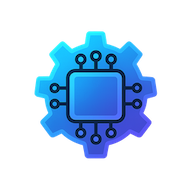

<table style="border: none; border-collapse: collapse;">
  <tr>
    <td style="border: none; padding: 0;">
      
    </td>
    <td style="border: none; padding: 0;">
      <h1>AI Engineering Hands-On</h1>
      Repo for the AI Engineering Hands-On <a href="https://www.youtube.com/playlist?list=PLRBkbp6t5gM151rUSi6Z8T8n6UCppEEMH">Playlist</a>.
    </td>
  </tr>
</table>

## Table of Contents

- [Companion Videos](#companion-videos)
- [Dev Environment Config](#dev-environment-config)


## Companion Videos
- [Intro](https://youtu.be/HaXveXkSwlQ)
- [Dev Environment Config](https://youtu.be/36sbUO2LaOk)

<p align="right"><a href="#table-of-contents" style="font-size: 0.85em;">↑ toc</a></p>

## Dev Environment Config
Links to resources discussed in the [Dev Environment Config](https://youtu.be/36sbUO2LaOk) video.

### Links
- [Homebrew](https://brew.sh/)
- [Python](https://www.python.org/downloads/)
- [Cursor](https://cursor.com/home?from=agents)
- [uv](https://docs.astral.sh/uv/getting-started/installation/)
- [Ollama](https://ollama.com/)
- [llama3.2](https://ollama.com/library/llama3.2)
- [Postman](https://www.postman.com/downloads/)
- [OpenAI](https://openai.com/index/openai-api/)

### Commands
Commands executed in Terminal in the [Dev Environment Config](https://youtu.be/36sbUO2LaOk) video.

#### uv
```bash
uv --version
uv run --python 3.12 python --version
uv python install 3.12

ls -al
uv venv --python python3.12
source .venv/bin/activate

uv pip list
uv pip install jupyterlab
uv pip list
uv run --with jupyter jupyterlab

deactivate
```

#### Ollama
```bash
ollama list
pgrep ollama

ollama pull llama3.2:3b
ollama run llama3.2:3b
Who are you?
/bye

pgrep ollama

ollama serve
pgrep ollam

pkill ollama
pgrep ollama
```

<p align="right"><a href="#table-of-contents" style="font-size: 0.85em;">↑ toc</a></p>
